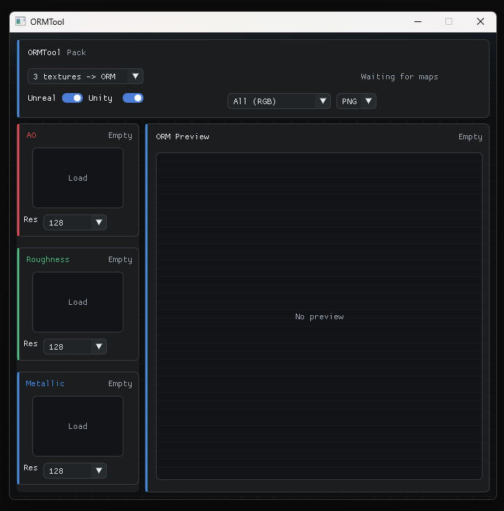

# ORMTool


ORMTool is a lightweight C++ desktop application for packing and splitting ORM texture maps. It combines separate grayscale Ambient Occlusion, Roughness, and Metallic maps into engine-ready ORM textures, can split packed ORM textures back into separate maps, and provides a compact Dear ImGui interface with live previews.

---

## Features

- Pack separate grayscale maps into ORM textures:
  - Unreal Engine layout: AO in R, Roughness in G, Metallic in B.
  - Unity mask layout: Metallic in R, AO in G, white fill in B, inverted Roughness in A.
- Split existing packed ORM textures back into AO, Roughness, and Metallic maps.
- Choose split input layout between Unreal ORM and Unity Mask.
- Generate Unreal and Unity outputs independently or together.
- Preview the packed ORM texture in RGB or individual channel views:
  - All RGB
  - AO (R)
  - Roughness (G)
  - Metallic (B)
- Save the current preview/channel view as PNG, JPG, BMP, or TGA.
- Load images through native file dialogs.
- Auto-create split output names next to the source ORM texture.
- Pick target resolutions from 128, 256, 512, 1024, 2048, and 4096.
- Resize source maps during packing and splitting.
- Run image generation on a background thread with a live progress indicator.
- Display loading and processing states directly in the UI.
- Use UTF-8 and wide-path file handling on Windows for safer file output.
- Keep public headers documented with Doxygen-style comments.

---

## Screenshot



---

## Workflow

### Pack to ORM

1. Select `Pack`.
2. Load AO, Roughness, and Metallic source maps.
3. Pick the resolution for each source map.
4. Enable `Unreal`, `Unity`, or both output layouts.
5. Start processing.
6. Preview the generated ORM texture and optionally save the preview/channel view.

### Split From ORM

1. Select `Split`.
2. Choose `Unreal ORM` or `Unity Mask` as the source layout.
3. Load the packed ORM texture.
4. Pick the output resolutions.
5. Start processing.
6. Review the generated AO, Roughness, and Metallic outputs.

---

## Dependencies

The project uses CMake and fetches most runtime dependencies automatically:

- [GLFW](https://www.glfw.org/) for windows, context creation, and input.
- [Dear ImGui](https://github.com/ocornut/imgui) for the UI.
- [Native File Dialog](https://github.com/mlabbe/nativefiledialog) for file picker dialogs.
- [stb_image, stb_image_write, stb_image_resize2](https://github.com/nothings/stb) for image loading, writing, and resizing.
- OpenGL for texture preview rendering.

Linux builds also require GTK3, X11, and pthread-related system libraries.

---

## Build

```sh
cmake -S . -B build
cmake --build build --config Debug
```

The executable is written to:

```text
build/out/Debug/ORMTool.exe
```

On single-config generators, use the generator's normal output directory instead of `Debug`.

---

## Documentation

The project headers use Doxygen-style comments for public interfaces, core data structures, UI state, file export helpers, and MVC boilerplate.

---

## License

This project is licensed under the MIT License.
